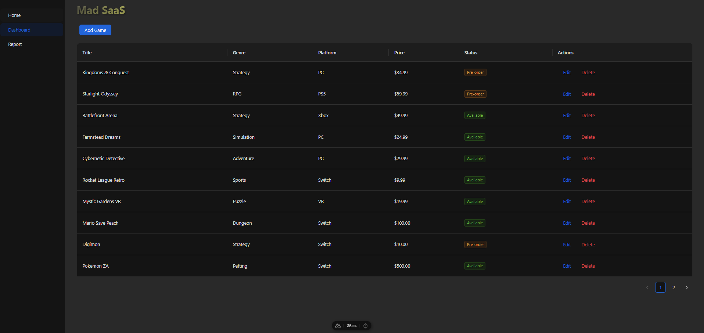
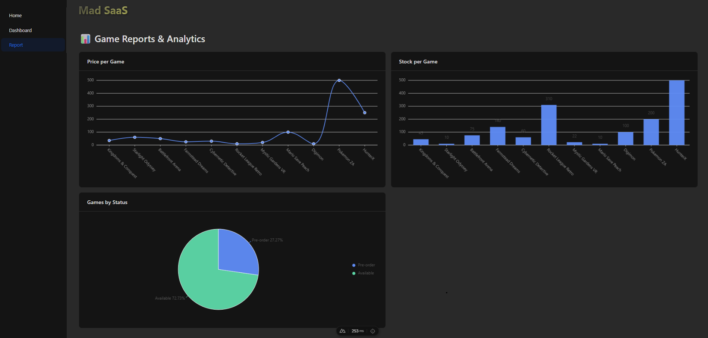

# Mad Saas Stimulate Game Store 🧸

Explore new framework approach with Nuxt + Vue.

This project simulates a Game Store UI

built as a Single-Page Application (SPA) — a front-end only

experience designed for learning, prototyping, and UI experimentation.

- 🌀 Nuxt - Vue framework (SPA mode)
- ⚡ Vue —Reactive frontend framework
- 📃 Mock-Json — Simulated data source
- 🧪 vee-validate + yup — Form validation
- 📊 @antv/g2plot — Data visualization (charts)
- 🗂️ Ant Design Vue - UI library for layout and forms
- ⚙️ Axios - Data fetching and mock API handling
- 💻 TypeScript - Type-safe development

# Desktop View

# Mobile View

